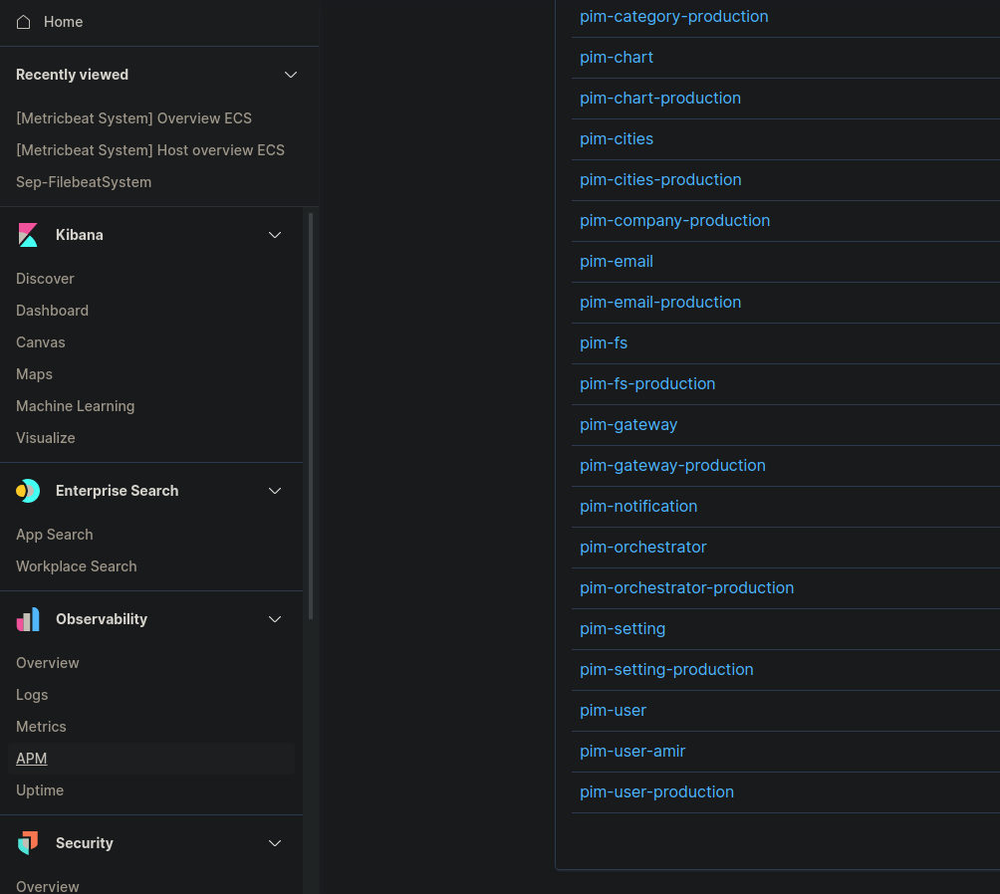
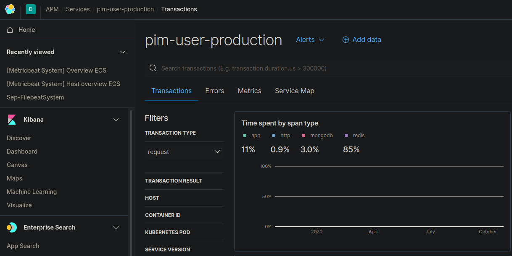
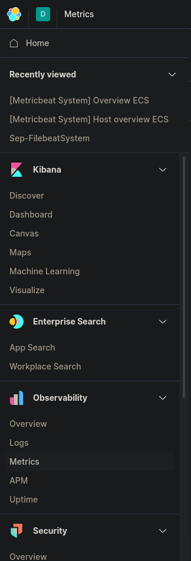
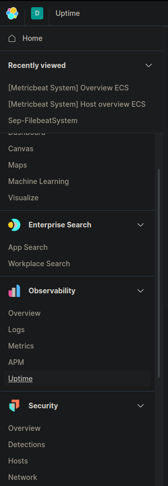

<h1 style="color:white">Starting elastic stack with SSL </h1>

- <span style="color: cyan; font-size:15px"> First Generate the certificates(only needed once)</span>

```bash
  docker-compose -f create-certs.yml run --rm create_certs
```


- <span style="color: cyan; font-size:15px">Start configured elastic node </span>

```bash
  docker-compose up -d
  ```

- <span style="color: cyan; font-size:15px"> for set optional passwords use this command </span>

```bash
  docker exec -it elasticsearch /bin/bash -c "bin/    elasticsearch-setup-passwords interactive --batch --url https://elasticsearch:9200"
```

 > https://www.elastic.co/guide/en/elastic-stack-get-started/7.x/get-started-docker.html

<br>

<h1 style="color:white">Init alert service </h1>

- <span style="color: cyan; font-size:16px">First you should set alert app configs in order to connect to elasticsearch. </span>

<p style="color: lightgreen; font-size:15px"> Step 1: </p>

> Go to &nbsp; &nbsp; /alert-app/config/default.yml and set this informations:

```yaml
alert:
    host: <-elasticsearch host->
    port: <-elasticsearch port(default 9200)->
    auth:
        - username: <-elasticsearch username->
          password: <-elasticsearch password->
    ssl:
        - ca: <-certification ca file->
          key: <-certification key file->
          cert: <-certification cert file->
```

<p style="color: lightgreen; font-size:15px"> Step 2: </p>

> In the same file, set this information for SMTP service. If you don't want to use smtp service, just set the status to false.

```yaml
email:
    status: true
    host: <-smtp host->
    port: <-smtp port->
    subject: <-email subject->
    auth:
        - username: <-smtp username->
          password: <-smtp password->
    receivers:
        -<-receivers email address array->
    sender: <-sender email address->
```
<p style="color: lightgreen; font-size:15px"> Step 3: </p>

> In the same file, set this information for sms service. If you don't want to use sms service, just set the status to false.

```yaml
sms:
    status: true
    host: <-sms service host->
    port: <-sms service port->
    version: 1 #leave it
    URIs:
        - sendSms: sendSms #leave it
    receiver: 
      - <-receivers phone number array->
```

<p style="color: lightgreen; font-size:15px"> Step 4: </p>

> In the same file, set this information for alerting interval time. 

```yaml
job:
    time: '*/5 * * * *' #every 5 minutes
```

<br>

<h1 style="color:white">Start getting alerts </h1>

- <span style="color: cyan; font-size:16px"> We provide alerts for system metrics, apm server and server uptime. To get alert for each of them, follow this steps. 

<br>

<h2 style="color:white">apm server </h2>

---
<br>

<p style="color: lightgreen; font-size:15px"> Step 1: </p>

>Go to kibana. In the left side under Observability, click on APM
>> Select your service.


<div style="display:flex; justify-content:center; align-items:center; width:100%">

</div>


>In the new page, click on alerts on the top of the screen
>> select Create threshold alert
>>> Pick your alert type between error and transaction duration.

<div style="display:flex; justify-content:center; align-items:center; width:100%">

</div>


>In the right side you'll see create Alert menu.Fill the inputs  with your own arbitrary data.
>> In Select an action type, click on "index"
>>> In the Index connector click on "Add new". Choose a name for the connector and  index. Don't forget to write down your index name because you need that name a few steps ahead. Then click on "save" button.
>>>>In the "Document to index" part, insert below json .If you want to add ip address to your data, insert your service ip address in the json else you should remove it.

```json
{
"alert_id" : "{{alertId}}",
"alert_name" : "{{alertName}}",
"spaceId" : "{{spaceId}}",
"tags": "{{tags}}",
"alert_instance_id" : "{{alertInstanceId}}",
"context_serviceName" : "{{context.serviceName}}",
"transaction_type":"{{context.transactionType}}",
"isReaded": false,
"ip": "your service ip address"
}
```

<p style="color: lightgreen; font-size:15px"> Step 2: </p>

> Go to &nbsp; &nbsp; /alert-app/config/default.yml and insert below information in the indices/apm part. If your alerts are primary, set the isPrimary to true else set it false.

```yaml
<-service_name->: 
            index: <-index_name->
            isPrimary: true/false
```
Now restart the alert service.


<h2 style="color:white"> System metrics</h2>

---
<br>
<p style="color: lightgreen; font-size:15px"> Step 1: </p>

>Go to kibana. In the left side under Observability, click on "Metrics"
>> click on your server and select create alert.

<div style="display:flex; justify-content:center; align-items:center">

</div>


>In the right side you'll see create Alert menu.Fill the inputs  with your own arbitrary data.
>> In Select an action type, click on "index"
>>> In the Index connector click on "Add new". Choose a name for the connector and  index. Don't forget to write down your index name because you need that name a few steps ahead. Then click on "save" button.
>>>>In the "Document to index" part, insert below json .If you want to add ip address to your data, insert your service ip address in the json else you should remove it.


```json
{
  "alert_id": "{{alertId}}",
  "alert_name": "{{alertName}}",
  "alert_instance_id": "{{alertInstanceId}}",
  "context_message": "{{context.message}}",
  "space_id":"{{spaceId}}",
  "tags":"{{tags}}",
  "context_group":"{{context.group}}",
  "context_alertState":"{{context.alertState}}",
  "context_reason":"{{context.reason}}",
  "context_timestamp":"{{context.timestamp}}",
  "context_value":"{{context.value}}",
  "context_metric":"{{context.metric}}",
  "context_threshold":"{{context.threshold}}",
  "isReaded":false,
  "ip": "server ip address"
}

```
<p style="color: lightgreen; font-size:15px"> Step 2: </p>


> Go to &nbsp; &nbsp; "/alert-app/config/default.yml" and insert below information in the indices/metrics part. If your alerts are primary, set the isPrimary to true else set it false.

```yaml
<-service_name->: 
            index: <-index_name->
            isPrimary: true/false
```
Now restart the alert service.


<h2 style="color:white"> server uptime</h2>

---
<br>
<p style="color: lightgreen; font-size:15px"> Step 1: </p>

>Go to kibana. In the left side under Observability, click on "Uptime"
>> select your server and click on Alerts and choose create alert.
>>> Choose your type of alert between Monitor status alert and TLS alert.

<div style="display:flex; justify-content:center; align-items:center">

</div>


>In the right side you'll see create Alert menu.Fill the inputs  with your own arbitrary data.
>> In Select an action type, click on "index"
>>> In the Index connector click on "Add new". Choose a name for the connector and  index. Don't forget to write down your index name because you need that name a few steps ahead. Then click on "save" button.
>>>>In the "Document to index" part, insert below json .If you want to add ip address to your data, insert your service ip address in the json else you should remove it.


```json
{
"alert_id": "{{alertId}}",
"alert_name": "{{alertName}}",
"alert_instance_id": "{{alertInstanceId}}",
"context_message": "{{context.message}}",
"space_id":"{{spaceId}}",
"tags":"{{tags}}",
"context_downMonitors_Geo":"{{context.downMonitorsWithGeo}}",
"state_firstCheckedAt":"{{state.firstCheckedAt}}",
"state_firstTriggeredAt":"{{state.firstTriggeredAt}}",
"state_currentTriggerStarted":"{{state.currentTriggerStarted}}",
"state_isTriggered":"{{state.isTriggered}}",
"state_isCheckedAt":"{{state.lastCheckedAt}}",
"state_lastResolvedAt":"{{state.lastResolvedAt}}",
"state_lastTriggeredAt":"{{state.lastTriggeredAt}}",
"isReaded":false,
"ip":"server ip address"
}

```
<p style="color: lightgreen; font-size:15px"> Step 2: </p>


> Go to &nbsp; &nbsp; "/alert-app/config/default.yml" and insert below information in the indices/Uptime part. If your alerts are primary, set the isPrimary to true else set it false.

```yaml
<-service_name->: 
            index: <-index_name->
            isPrimary: true/false
```
Now restart the alert service.


